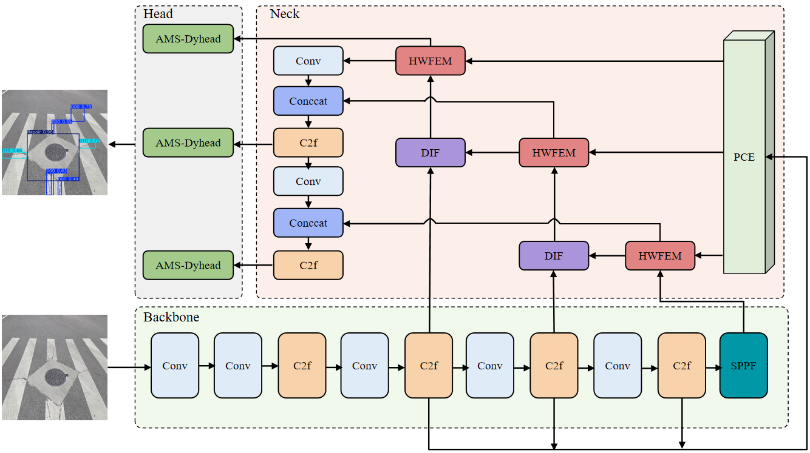
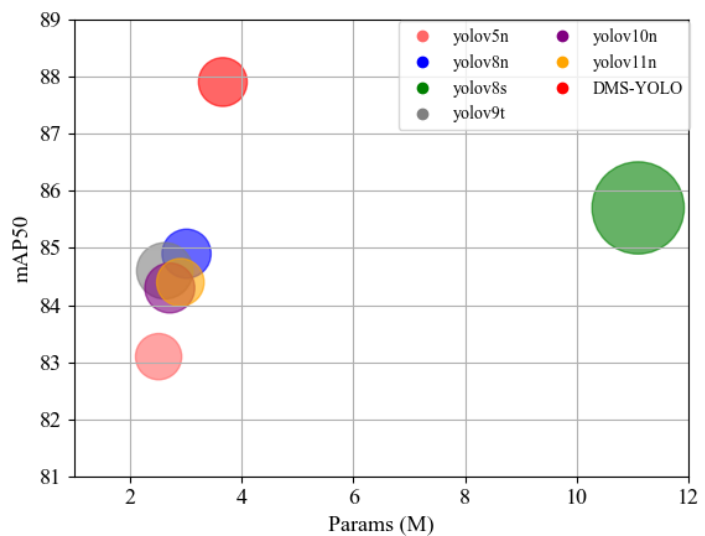

# DMS-YOLO

## Environment

- python 3.11

## Requirements

Please `pip install` the following packages:

- torch>=2.1.1
- torchvision>=0.16.1
- numpy>=1.26.4
- opencv
- timm>=1.0.7

The following is the required packages for AMS-Dyhead:

- mmcv>=2.2.0
- DCNv3（Need to compile）

## Datasets

[ RDD-2022 ]

[ SVRDD ]

## Inference

### step1: Go to the directory where the pyproject.toml file is located

`pip install -e .`

### Step2: Download the required data and update the data file: cfg/datasets

### step3: Select the desired model file: cfg/models

### step4: Run the following script for training

`python train.py`

### step5: Run the following script to evaluate

`python val.py`

## Results

|     模型     | Precision |  Recall  | mAP50/%  | mAP50-95/% | Param/10^6 | GFLOPs  | F1-score/% | 模型大小/MB |
| :----------: | :-------: | :------: | :------: | :--------: | :--------: | :-----: | :--------: | :---------: |
| Faster R-CNN |   52.0    |   79.8   |   71.5   |    43.3    |   41.45    |  94.4   |     63     |    108.0    |
|     SSD      |   75.4    |   51.2   |   70.9   |    39.1    |   26.77    |  60.7   |     61     |    33.7     |
|   YOLOv5n    |   82.9    |   78.5   |   93.1   |    55.7    |  **2.51**  | **7.2** |     80     |   **5.1**   |
|   YOLOv8n    |   83.0    |   80.6   |   84.9   |    58.6    |    3.01    |   8.1   |     81     |     6.0     |
|   YOLOv8s    |   84.6    |   81.6   |   85.7   |  **60.2**  |    11.1    |  28.7   |     83     |    21.5     |
|   RT-detr    |   85.5    |   79.2   |   84.0   |    57.2    |    29.3    |  105.2  |     82     |    56.4     |
|   YOLOv9t    |   83.4    |   76.5   |   84.6   |    55.6    |    2.62    |  10.7   |     79     |    17.1     |
|   YOLOv10n   |   85.2    |   75.2   |   84.3   |    56.5    |    2.71    |   8.4   |     80     |     5.5     |
|   YOLOv11n   |   85.4    |   77.3   |   84.4   |    58.3    |    2.90    |   7.6   |     81     |     5.8     |
|   DMS-YOLO   | **85.5**  | **82.7** | **87.9** |    59.8    |    3.66    |   8.0   |   **84**   |     7.3     |

*(The bubble size indicates the amount of computation)*

**keywords**

road defect detection; YOLOv8；characteristic pyramid network; dynamic detection head; deformable convolution; Loss function

### Concat

Yongran Li (202308540421037@ctgu.edu.cn) 
